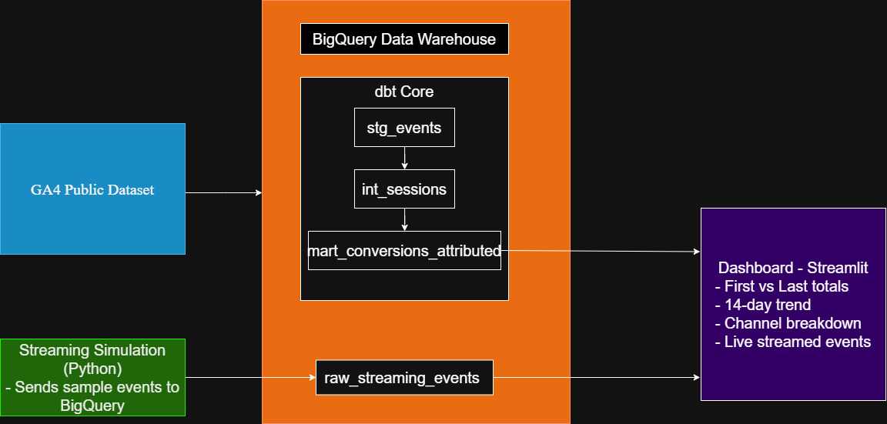
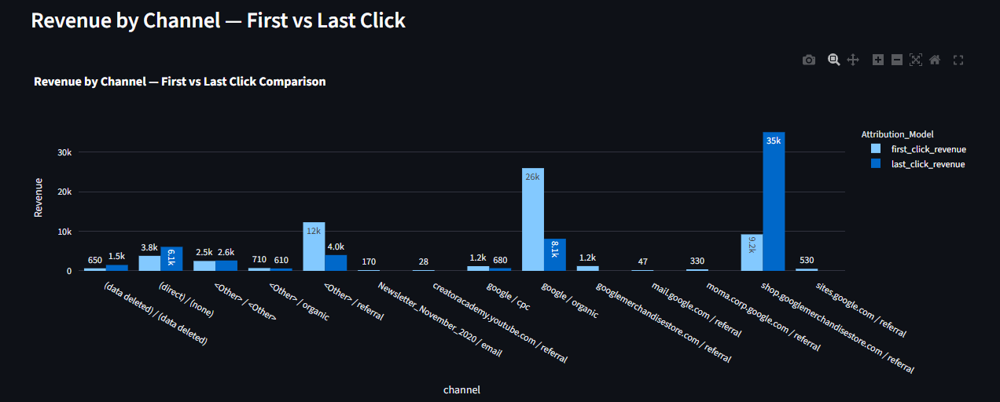
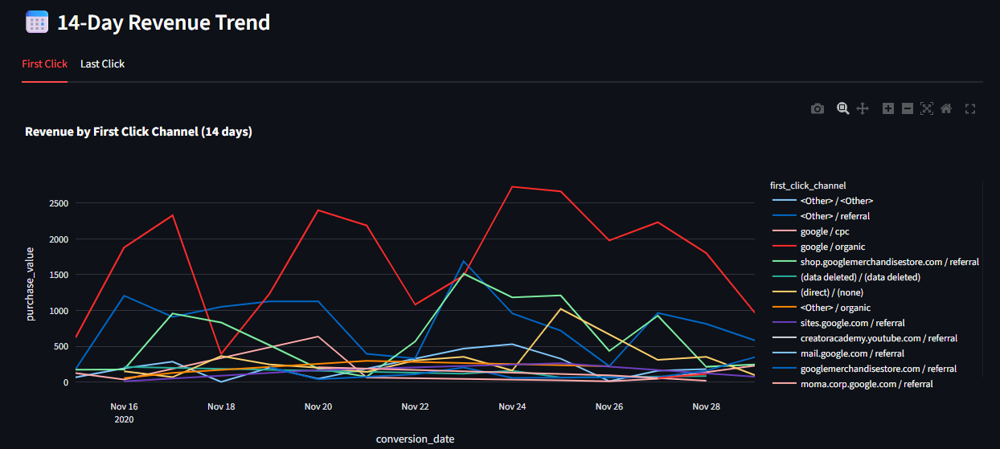
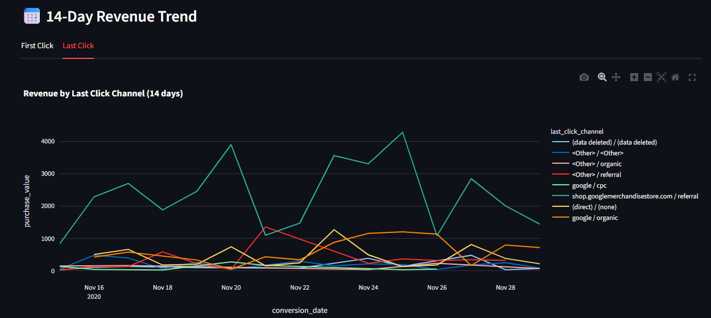
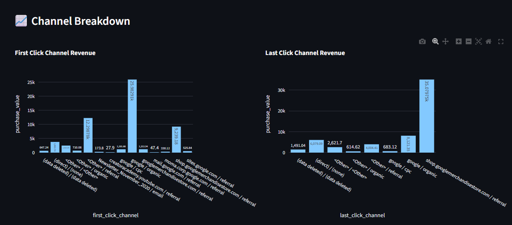
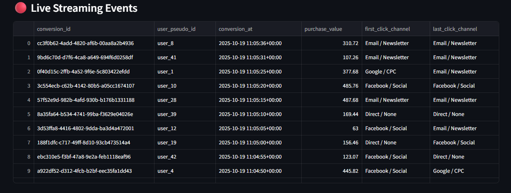

# marketing-attribution-pipeline
This project implements a marketing attribution pipeline. It processes data,  from  Google Analytics 4 (GA4), to model and analyze marketing channel effectiveness. The pipeline uses dbt to transform raw data into meaningful models, streams data into BigQuery, and presents the results in an interactive Streamlit dashboard.

---

## 🚀 Key Features
- **Batch Processing**: dbt models for robust, tested, and documented transformations.

- **Attribution Models**: Implements both First-Click and Last-Click attribution logic.

- **Real-Time Simulation**: A Python script streams new conversion events directly into BigQuery to demonstrate near-real-time updates.

- **Interactive Dashboard**: A Streamlit dashboard visualizes key metrics, channel performance, and a live panel of incoming events.

---

## 🏛️ Architecture

The pipeline follows a modern data stack architecture, moving data from raw storage to a live dashboard.

1. Data Source: Public GA4 dataset hosted in Google BigQuery (bigquery-public-data.ga4_obfuscated_sample_ecommerce).

2. Storage: Google BigQuery serves as the data warehouse for both raw data and transformed models.

3. Transformation: dbt connects to BigQuery to run a series of SQL models that clean, prepare, and calculate the attribution logic.

4. Streaming Ingestion: A Python script (stream_script.py) simulates a data stream by generating sample events and inserting them into a dedicated BigQuery table.

5. Presentation: A Streamlit application (app.py) queries the final dbt models and the streaming table to populate a real-time dashboard.

---

## 🛠️ Tech Stack

- **Cloud Platform**: Google Cloud Platform (GCP)

- **Data Warehouse**: Google BigQuery

- **Data Transformation**: dbt

- **Backend & Streaming**: Python

- **Dashboarding**: Streamlit

---

## Project Structure

    marketing-attribution-pipeline/
    ├── dbt/                    # dbt project for data transformation
    ├── streaming_script/       # Python script for streaming data to BigQuery
    ├── dashboard/              # Streamlit application for the dashboard
    ├── images/                 

---

## 🚀 Getting Started
### Running on a Google Cloud VM
If you are running this project on a Google Compute Engine (GCE) VM instance, you can simplify authentication by using the VM's attached service account. This avoids the need to manage local credential files.

When creating your VM instance, configure the following under the Identity and API access section:

1. Service account: Select Compute Engine default service account.

2. Access scopes: Select Allow full access to all Cloud APIs.

This configuration grants the VM the necessary permissions to interact with other Google Cloud services in the same project, such as BigQuery, without any additional authentication steps from within the VM's environment.

**Prerequisites**

1. Python 3.12

2. A Google Cloud Platform (GCP) project.

3. git installed on your machine.

**Installation**
1. Create and activate a virtual environment:

        python3 -m venv ~/dbt-env
        source ~/dbt-env/bin/activate
   
2. Clone the repository:

        cd dbt-env
        git clone https://github.com/muralimittireddy/marketing-attribution-pipeline.git

3. Install the required Python packages:

        pip install --upgrade pip
        pip install dbt-bigquery google-cloud-bigquery python-dotenv plotly pandas streamlit streamlit_autorefresh

## ⚙️ Configuration

1. **Configure dbt Profile**:

    - Navigate to the dbt project directory:
      
          cd ~/dbt-env/marketing-attribution-pipeline/dbt
    - Open the profiles.yml file and replace the placeholder project ID and dataset with your GCP project ID and BigQuery dataset.
    
2. **Create Environment File**:
    
    - Create a .env file in the ~/dbt-env/marketing-attribution-pipeline directory.
    - Add the following environment variables to the .env file, replacing the values with your specific configuration:
    
          PROJECT_ID=<your-gcp-project-id>
          DATASET=<your-bigquery-dataset>
          MART_TABLE=<your-mart-table-name>
          STREAM_TABLE=<your-stream-table-name>

3. **Update File Paths**:

    - In ~/dbt-env/marketing-attribution-pipeline/streaming_script/stream_script.py, update the path to the .env file.
    - In ~/dbt-env/marketing-attribution-pipeline/dashboard/app.py, update the path to the .env file.

## Usage

1. **Run dbt Models**:

   - Navigate to the dbt project directory:

         cd ~/dbt-env/marketing-attribution-pipeline/dbt
     
   - Verify the dbt connection to BigQuery:

         dbt debug

   - Run the dbt models to transform your data:
  
         dbt run

   - Run the data quality tests:
  
         dbt test

2. **Set up BigQuery Table for Streaming**:

   - Execute the following SQL query in your BigQuery console to create the table for streaming data:

          CREATE TABLE `your-gcp-project-id.your-bigquery-dataset.stream_events_demo` (
          conversion_id STRING,
          user_pseudo_id STRING,
          conversion_at TIMESTAMP,
          purchase_value FLOAT64,
          first_click_channel STRING,
          last_click_channel STRING
          )
         PARTITION BY DATE(conversion_at)
         CLUSTER BY conversion_id;
     
     - Note: Replace your-gcp-project-id and your-bigquery-dataset with your actual project ID and dataset name.

3. **Run the Streaming Script**:

    - Navigate to the streaming script directory:

          cd ~/dbt-env/marketing-attribution-pipeline/streaming_script
      
    - Execute the script to start streaming data:

          python3 stream_script.py

4. **Launch the Streamlit Dashboard**:

    - Navigate to the dashboard directory:

          cd ~/dbt-env/marketing-attribution-pipeline/dashboard

    - Run the Streamlit application:

          streamlit run app.py
## 📊 Dashboard

The interactive dashboard provides insights from the attribution models and a live view of streamed events.

  - The dashboard includes:

      - First vs Last totals conversion totals by channel.

      - A 14-day trend line of attributed conversions.
   
      - Channel Breakdown

      - A Live panel that updates to show data from the streaming script.

